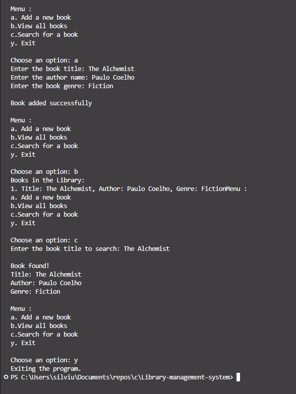

# Library-management-system

📌 Project Overview

This project is a basic menu-driven Library Management System written in C.
It allows users to manage a collection of books with simple operations such as:

Adding New Books

Viewing All Books

Searching for Books

The system uses loops and conditional statements to navigate through the menu and manage the book records.

⚙️ Features

Add new books with details (title, author, ID, etc.)

View all stored books

Search books by title or ID

Menu-driven interface for easy navigation

Runs until the user decides to exit

🖥️ How It Works

The program displays a main menu with options.

The user selects one of the operations (Add, View, Search, Exit).

The program performs the action using arrays/structures, loops, and conditionals.

The user can continue managing the library until they choose to exit.

🛠️ Requirements

C compiler (e.g., GCC)

Works on Windows, Linux, or macOS

🚀 Compilation & Execution
Compile the program:
gcc library_management.c -o library_management

Run the program:
./library_management

📂 File Structure
library-management/
│── library_management.c # Main program source code
│── README.md # Project documentation

📖 Example Usage
--- Library Management System ---

